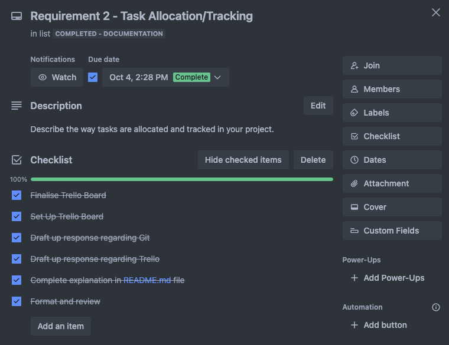

# T2A2: API Webserver - Workout Together Planner API

Welcome to the documentation of Hendric Widjaja's - T2A2: API Webserver.

## Quick Links

Please use the links below to quickly access key parts of this documentation.

### Project Management & Task Allocation & Tracking

- GitHub (Legacy Repository): [https://github.com/hendricwidjaja/T2A2-Webserver-API](https://github.com/hendricwidjaja/T2A2-Webserver-API)  
- GitHub (Current Repository): [https://github.com/hendricwidjaja/T2A2WebServerAPI](https://github.com/hendricwidjaja/T2A2WebServerAPI)
- Trello: [https://trello.com/b/2OOqzzxT/t2a2-api-webserver](https://trello.com/b/2OOqzzxT/t2a2-api-webserver)

### Requirements

- Requirement 1: [R1 - The problem and the solution](#r1---explain-the-problem-that-this-app-will-solve-and-how-this-app-addresses-the-problem)
- Requirement 2: [R2 - Task allocation & Tracking](#r2---task-allocation--tracking-trello--github)
- Requirement 3: [R3 - Third-Party Services, Packages & Dependencies](#r3---3rd-party-services-packages--dependencies)
- Requirement 4: [R4 - Benefits & Drawbacks of Postgresql](#r4---benefits--drawbacks-of-of-postgresql)
- Requirement 5: [R5 - Features, purpose & functionalities of the ORM used in this app](#r5---explain-the-features-purpose-and-functionalities-of-the-orm-system-for-this-app)
- Requirement 6: [R6 - Entity Relationship Diagram](#r6---entity-relationship-diagram)
- Requirement 7: [R7 - Models & Relationships and database implementation](#r7---explain-the-implemented-models-and-the-relationship-including-how-the-relationships-aid-database-implementation)
- Requirement 8: [R8 - API Endpoints Tutorial & Explanation](#r8---api-endpoints-tutorial--explanation)

## Quick Notes

### PEP 8 Style Guide

The [PEP8 Style Guide](https://peps.python.org/pep-0008/) for Python Code (written by Guido van Rossum, Barry Warsaw & Alyssa Coghlan) was implemented for the writing of this application's code. For commenting purposes (as per recommendation from PEP 8), PEP 257 is also adopted for the formatting of docstrings. Examples of how these style guides were implemented are as per below:

- Space on either side of binary operators for assignment, augmented assignment, comparison & booleans
- Imports to be located at the top of each file
- Imports to be grouped by standard, 3rd party and local application
- 4 spaces per indentation level
- Consistency of hanging indent application for continuation lines
- Snake case with lower characters for all variable (e.g. snake_case)
- Upper case with underscores for all constants (e.g. UPPER_CASE)
- Consistency of 2x blank lines between functions
- Consistency of 1x blank where necessary to break up code blocks
- Consistency of double quotes for all strings (if possible)
- Ensure use of white-space characters are consistent and avoided:
  - immediately inside parentheses, brackets or braces
  - between trailing commas,
  - before commas, semicolon or colon
  - immediately before open parenthesis
- Descriptive variable names

A snippet of code from the 'Delete User' route has been provided below which incorporates both PEP 8 and PEP 257 for longer descriptive type comments.

```bash
# /auth/users/<int:user_id> - DELETE - Delete user
@auth_bp.route("/users/<int:user_id>", methods=["DELETE"])
@jwt_required() # Check if the user has a valid JWT token
@auth_as_admin_or_owner # Check if user is authorised and if resource exists
def delete_user(user_id):
    '''UPON REQUEST: database will keep any public routines but 
    delete private ones (default = delete all). 
    Will also keep any exercises created by user by transferring ownership.
    This will keep data integrity and also allow users to still have access
    to these public routines
    '''
    # Grab data from body of JSON request (provide empty dictionary if body is empty)
    body_data = request.get_json(silent = True) or {}

    # Grab "delete_public_routines" from data (default to True if not provided)
    delete_public_routines = body_data.get("delete_public_routines", True)

    # Validate if user input is either boolean (true or false)
    if not isinstance(delete_public_routines, bool):
        # If not boolean, submit an error
        return {"error": "Invalid input for 'delete_public_routines'. "
        "Please input true or false."
        }, 400
```

---

## R1 - Explain the problem that this app will solve and how this app addresses the problem

### What is the problem?

With health being one of the most important factors of life itself, its important to exercise on a regular basis. Some of the main factors which deter and people from exercising are:

- social support
- accountability and commitment
- Cost of activities & facilities

A study in 2021 ran a specific study which measured the effect of providing social reward and support for a group of runners. The study proved that associating a positive experience with exercise leads to higher levels of energy, enjoyment and improved performance (without any additiona perceived effort) ([Davis, MacCarron & Cohen 2021](https://www.ncbi.nlm.nih.gov/pmc/articles/PMC8443045/)). They continued to strongly propose the importance and influence of social engagement and the feeling of belonging for individuals to foster deeper connections that can lead to better psychological, physical and social well being.

Accountability partners has been a term that has been thrown around in the last couple of years and for good reason. According to a study conducted in the US, an individual has a 65% success rate for achieving their goals if they share their goal with others. This success rate also goes all the way up to 95% if the individual commits completely and conducts check-ins with a accountability partner. This idea is just as successful when applied specifically to fitness and health goals ([Chaudhuri, A 2023](https://www.theguardian.com/lifeandstyle/2023/nov/27/the-buddy-boost-how-accountability-partners-make-you-healthy-happy-and-more-successful)).

Other factors such as the cost of activities access to facilities also plays a significant part to the difficulty in committing to a healthy lifestyle. This can be due to the cost of gym memberships, exercise classes, personal trainers and the limitations of certain environments that individuals may experience due to their geographical location.

### How does this app address the problem?

The 'Workout Together Planner' API is an application which promotes the health and wellbeing of individual by bringing them together. It addresses the aforementioned factors which can deter an individual from reaching their goals and sustaining a healthy lifestyle.

The application allows users to create accounts and follows a social media platform feel. Although the API is still in its earlier stages, the current features allow users to:

- Create accounts
- Create exercises (e.g. Bench Press, Squats, Deadlifts, or even *Tony's Crazy Leg Stretch Thingy Mabob?!*)
- Create routines that can be viewed by other (if the user chooses to make the routine public)
- Add, remove and update exercises to their routines
  - Each exercise that is added can contain various characteristics such as sets, reps, weight, duration, etc.
- Like routines (which creates popularity and promotes routines that user's have made)
- Copy routines into their own private list which they can edit as they please

The application aims to provide further features in the future which will include more traditional social media type features such as messaging, following, posting and commenting. Not only this but it will also feature more fitness application related functions such as workout session logging and tracking.

The ultimate premise of this API is to address the detering factors of social support, accountability and commitment as well as the cost of activities and facilities. This API allows the creation of a global community where others can contact eachother to keep eachother accountable, motivate one another, share their fitness goals and successes and form stronger commitments to fitness and health. By only needing access to the internet, it drives down the problem of accessibility. Who needs a personal trainer when you have can have a community in your pocket that can help you along the way.

---

## R2 - Task Allocation & Tracking (Trello & GitHub)

### Trello


A link to a copy of the entire Trello Workspace can be found here:  
[https://trello.com/invite/b/66e1965df452f51f32ff2c94/ATTIb2433d8920ee741ceeda4fd0d9165de4C168FA8E/t2a2-api-webserver](https://trello.com/invite/b/66e1965df452f51f32ff2c94/ATTIb2433d8920ee741ceeda4fd0d9165de4C168FA8E/t2a2-api-webserver)

The creation of this API was conducted in parallel with the usage of Trello. Below are the main components ideas, and features of Trello that were utilised for task allocation and tracking purposes:

Tasks were separated into 2x main groups:

- Documentation
- Code

Each group was separated into futher categories/lists to allow the tracking of progress for the project. These lists were:

- To do
- WIP (Work in progress)
- Completed

Given the above structure, the creation of 'cards' could be implemented. Each card contained various small-medium sized tasks which needed to be completed to finalise the project as a whole.  

I decided to breakdown the tasks for documentation as per the requirements in the assignment (R1 - R8).  Each requirement was then broken down into smaller tasks, which made the completion of the assignment more manageable. This includes tasks such as research, other specific requirement tasks and format / review.
In the category of code related cards, each card generally represented the completion of a model or a controller within the API. Each of these would again then include smaller tasks such as creating a new route, completing a new feature, code refactoring, testing and reviewing.  
These smaller tasks were generally input as individual items in the checklist section of a requirement or code task.  

Labels were also featured on the code cards for easier distinction between model and controller related cards.  

Dates for the completion of each card was also utilised to create a time plan for completion of each task, and the assignment as a whole.

Screenshots for each card can be viewed below, or you can check out the public Trello board using the link at the top of this section.

---

#### --> Documentation Category

##### --> Requirement Cards





---

#### --> Code Category

##### --> Initialisation Card


---

##### --> Model Cards


---

##### --> Controller Cards


---

### GitHub / Git

**NOTE**: Due to unforseen circumstances, the GitHub repository was required to be duplicated. However the legacy commits were not migrated.

The remote git repositories which are hosted on GitHub can be found using the links below:

**Legacy Repository**: [https://github.com/hendricwidjaja/T2A2-Webserver-API](https://github.com/hendricwidjaja/T2A2-Webserver-API)  
**Current Repository**: [https://github.com/hendricwidjaja/T2A2WebServerAPI](https://github.com/hendricwidjaja/T2A2WebServerAPI)

GitHub and Git were also used extensively throughout the creation of this API to date. As a source control tool (Git) which can be shared on the cloud via remote repositories (GitHub), any user can easily manage and track changes, 'save' various versions and even revert back to previous versions if need be. The main useful tools which were applied for the creation of this API include:

#### To initialise the repository

```bash
git init
```

#### To add specific (or all) files to a staging area (this allows Git to track files you want to be tracked)

```text
git add <filename> (OR) git add .
```

#### Creates a saved snapshot of the current version of the repository. This version can then be referred to at a later date or even reverted back to if need be

```bash
git commit -m "insert meaningful message" 
```

#### To 'push' the commit to the remote repository (which can then be accessed by others)

```bash
git push
```

#### Creating a new branch (creates a copy of the repository where a user can make changes without affecting the "main" branch). Useful for experimentation and testing and working in collaborative environments

```bash
git branch <new branch name> / git checkout <new branch name> 
```

#### Allows a user to merge their branch to the main branch (generally done on GitHub via git pull requests) which allows for better communication, collaboration and review processes before merging branches

```bash
git pull / git merge 
```

Although there were other useful features which were used within Git and GitHub such as the creation of **.gitignore** files, the above git commands form the basis of the main features used for source control and tracking changes to the project.

---

## R3 - 3rd Party Services, Packages & Dependencies

**NOTE**: For this application, it will be assumed that the user already has python3 installed.  

To check, you can follow the below quick guide.

```bash
# Type the below in your terminal
python3 --version 

# Example output
Python 3.9.6
```

If python is installed, you should see python accompanied by the version number as per above example.

If not, visit the offical website for Python at [https://www.python.org/downloads/](https://www.python.org/downloads/) and download Python3.

**NOTE 2**: Before installing any packages, always remember to create a virtual environment and activate it. For further information, please see the first package explanation below.

---

### virtualenv

**virtualenv** is a flexible 3rd party python package which allows for the creation of an isolated python environment. Although Python already comes with a venv module, virtualenv generally provides better compatability.  

A python environment comes in the form of a directory or folder (named venv or .venv by convention) and is usually created in the project root directory.  
The benefit of creating such environments allow for users to create multiple projects without them interfering with one another. This is useful when installing packages dependencies for a project.  

When an package is installed, the user will generally receive the latest version. As these packages receive updates, these new releases can tend to come with general bug fixes or even different methods for its functionality. This means that the old version of a package which works for one project, may not necessarily work for another. By isolating projects in different virtual environments, conflicts between varying versions of packages and dependencies can be avoided.  

The above pertains the main reason for its use in this API project.

To **install** virtualenv, simply follow the below:

``` BASH
pip3 install virtualenv # To install virtualenv
```

Once virtualenv is installed, you can create a virtual environment by following the below.

```BASH
python3 -m venv venv
```

Activating the virtual environment:

```BASH
source venv/bin/activate # to activate the virtual environment

'''If your virtual environment activates properly,  
you should see name of your virtual environemnt at  
the beginning of your shell prompt (e.g"(venv)").
'''
(venv) coolguy@coolguylaptop:~ directory/of/your/project$ # Example output
```

Deactivating your virtual environment:

```BASH
deactivate # to deactivate the virtual environment

'''Your shell prompt should return back to its  
original form if deactivation was successful.
'''
coolguy@coolguylaptop:~ directory/of/your/project$ # Example output
```

---

### PostgreSQL

**PostgreSQL** is an object relational database management system which is incorporated into this application for this very purpose. It allows for the storage of data in tables, rows and columns. PostgreSQL contains various features which gives it a long standing history of being **ACID** compliant. It ensures the atomicity, consistency, integrity and durability of the data it stores. It's robustness and ability to support complicated queries makes it a strong choice for the API. It supports these complexities via its strong feature set of creating:

- Primary Keys
- Foreign Keys
- Constraints (Unique, default, Nullable)
- Various datatypes

Other than the above, the Workout Together Planner API also utilises functions such as **rollbacks** which PostgreSQL supports. This allows any sessions or transactions to be cancelled in the event of errors that may cause integrity issues.

```bash
# Error handling & rollback 
except IntegrityError as err:
    db.session.rollback() # example of rollback implementation
    return {"error": f"An unexpected error occured when trying to add an exercise: {err}"}, 400
```

All in all, PostgreSQL is required for this application for its primary purpose of storing data and its ability to manage complex queries, allowing a user to receive, view, update and delete specific data based on a variety of conditions for various scenarios.

---

### psycopg2-binary

**psycopg2-binary** is a 3rd party library from Python which acts as the bridge/database driver between Flask and a PostgreSQL. In comparison to its older sibling (psycopg2), psycopg2-binary is much easier to install and works out of the box. It provides a comprehensive tool set for directly interacting with PostgreSQL, enabling the the ability to perform SQL type queries such as DDL (Data Definition Language) and DML (Data Manipualtion Language). In this application, we use sqlalchemy to provide create these SQL type queries and psycopg2-binary does the interactions with PostgreSQL (database). The installation of psycopg2-binary is crucial for the API to function as it acts as one of the middle men between Python and PostgreSQL.

To **install** psycopg2-binary, simply follow the below:

```BASH
pip3 install psycopg2-binary
```

---

### Flask

**Flask** is largely considered a micro web framework which is ultralight and easy to customise allowing various functionalities that can easily be extended through various libraries. It essentially acts as the backbone of the API. Its dependencies include:  

- **Werkzeug**: provides the underlying utilities for WSGI (Web Server Gateway Interface) applications. It enables parsing of HTTP requests, route and session handling, etc.  

- **Jinja 2**: provides HTML template rendering abilities (*not utilised in this API*)  

- **itsdangerous**: to allow cryptographic token generation and validation (leveraged by flask_jwt_extended)  

These dependencies are automatically installed when installing flask.

To **install** flask, simply follow the below:

```BASH
pip3 install flask
```

Within this API, Flask allows for the structuring of HTTP routing to specific controllers, allowing the API to then logically fetch, create, delete and update data, before rendering the response back to the user. Flask is a crucial component of this API to handle the various routes and ensures that the right logic is applied to the data and given back to the user. Essentially, flask acts as a central control hub for the view functions and rules that are applied to URLs.  

To **import** flask in your code, implement the below:

```bash
from flask import Flask # Imports the class Flask from flask
```

Below are examples of several routes within the API that provide various functions/logic (via Blueprints).

```bash
# Route with [GET] - fetches routines
@routines_bp.route("/", methods=["GET"])
@jwt_required(optional=True)
def get_routines():
```

```bash
# Route with [POST] - copies another routine
@routines_bp.route("/<int:routine_id>/copy", methods=["POST"])
@jwt_required()  # User must be logged in
def copy_routine(routine_id):
```

```bash
# Route with [PUT] or [PATCH]- updates a routine
@routines_bp.route("/<int:routine_id>", methods=["PUT", "PATCH"])
@jwt_required()
@auth_as_admin_or_owner
def update_routine(routine_id):
```

```bash
# Route with [DELETE] - deletes a routine
@routines_bp.route("/<int:routine_id>", methods=["DELETE"])
@jwt_required()
@auth_as_admin_or_owner # Performs validation & checks if user is admin or owner or resource
def delete_routine(routine_id):
```

---

### Flask-Bcrypt

**Flask-Bcrypt** is an extension which is utilised to manage various verification and authentication features in APIs. It utilises various dependencies which make it possible to seamlessly integrate password hashing and password checking (**bcrypt**). This feature is a crucial aspect of maintaining the applications security and protection of user data. This helps prevent the sensitive password data of users of an application to be exposed. Examples of the usage of password hashing and checking can be seen under the below bcrypt dependency explanation.

```bash
from flask_bcrypt import Bcrypt # Importing
pw_hash = bcrypt.generate_password_hash(password) # Hashing passwords
bcrypt.check_password_hash(pw_hash, candidate) # Checking passwords
```

---

#### An example of password hashing

```bash
# Hash the password using bcrypt
password = body_data.get("password")
if password:
    user.password = bcrypt.generate_password_hash(password).decode("utf-8")
# Add and commit to the DB
db.session.add(user)
db.session.commit()
# Return acknowledgement for the successful creation of a user account
return user_schema.dump(user), 201
```

#### An example of password checking

```bash
# If the user exists and the password is correct
if user and bcrypt.check_password_hash(user.password, body_data.get("password")): # checks password in database vs. JSON body
```

---

### Flask-JWT-Extended

**Flask-JWT-Extended** is what allows the JWT (JSON Web Token) functionality within this API. This authentication feature is another widely incorporated package which handles verfication of users and the provision of security tokens, enabling the control of access to data and database functions.  

This package can be imported via:

```bash
# Import flask_jwt_extended modules
from flask_jwt_extended import create_access_token, jwt_required, get_jwt_identity
```

**create_access_token**:

- creates an access token for a user, usually provided to the user in the header of a HTTP response when a user logs in

**jwt_required**:

- a decorator which can wrap a function to either allow or deny access, based on if a user is logged in or not

**get_jwt_identity**:

- a function which allows an application to easily retrieve the logged in user's ID, providing a quick form of identification

---

### SQLAlchemy & Flask-SQLAlchemy

SQLAlchemy is a dependency of Flask-SQLAlchemy. It is an object relational mapping (ORM) tool which allows for the abstraction and simplification of performing database operations. It does this by 'mapping' data within the database to Python objects. flask_sqlalchemy is an extension of flask which provides an easier time for developers to use SQLAlchemy within their application (acting like a bridge between SQLAlchemy and flask). The main features which are incorporated in this app are:

- ORM (Object Relational Mapping) = mapping data in the database to Python classes and objects
- Data Modelling = defining the structure and data types of tables/entities
- Relationships = defining the relationships between tables
- Transactions = the implementation of sessions and managing database interactions
- Querying = Providing a SQL like language to allow for CRUD operations via the transactions.

To install SQLAlchemy and Flask-SQLAlchemy, simply follow the below:

```BASH
pip3 install sqlalchemy # installs SQLAlchemy
pip3 install flask_sqlalchemy # installs flask_sqlalchemy
```

An example of the implementation of SQLAlchemy can be seen below for the RoutineExercise model within the API.

```bash
# Table for Routine Exercises - Uses SQLAlchemy to map data from the database to classes & objects
class RoutineExercise(db.Model): # Python class
    # Name of table
    __tablename__ = "routine_exercises"

    # Attributes of table (columns) - defines the structure and data types
    id = db.Column(db.Integer, primary_key=True) # Primary key
    sets = db.Column(db.Integer)
    reps = db.Column(db.Integer)
    weight = db.Column(db.Integer)
    distance_km = db.Column(db.Integer)
    distance_m = db.Column(db.Integer)
    hours = db.Column(db.Integer)
    minutes = db.Column(db.Integer)
    seconds = db.Column(db.Integer)
    note = db.Column(db.String)

    # Foreign Keys - provides ability to 
    routine_id = db.Column(db.Integer, db.ForeignKey("routines.id"), nullable=False)
    exercise_id = db.Column(db.Integer, db.ForeignKey("exercises.id"), nullable=False)

    # Define relationships with exercise and routine table
    exercise = db.relationship("Exercise", back_populates="routine_exercises")
    routine = db.relationship("Routine", back_populates="routine_exercises")
```

#### Examples of sessions

```bash
db.session.scalars(stmt).all() # Creating sessions
db.session.add(exercise) # Adding to session
db.session.commit() # Committing sessions to database
```

---

### Flask-Marshmallow, Marshmallow & marshmallow_sqlalchemy

**Flask-Marshmallow** is a 3rd party package for Python which enables an easier and more streamlined approach for the serialisation and deserialisation of data. Flask-marshmallow can be seen as a bridge or interface between flask and marshmallow which provides further functionality and customisation options.

**Marshmallow** is a dependency of Flask-Marshmallow and acts as the core library which manages the data serilization and deserialization. The process of data serialisation and deserialisation is important to allow for the conversion of data into understandable formats for both the client and API. Data received from clients are commonly provided in the body of HTTP requests using a serialised format such as JSON or XML. When this happens, Marshmallow will deserialise the data into a Python data structure, allowing the data to be used, manipulated and/or applied to logic within the API. Once the data is ready to be sent back to the client in the form of a response, marshmallow will serialise the data back into JSON format which gets attached to the body of the response.  

In addition to this process, Marshmallow also provides the functionality for data validation. While simple data validation occurs at the flask level, Marshmallow does most of the heavy lifting when it comes to validation. In this API, it acts as the main bodyguard to the database, ensuring that the database only receives expected data and in predefined structures.

**marshmallow_sqlalchemy** is an extension of Marshmallow which provides further functionality when working with SQLAlchemy such as relationship handling, field customisation and even auto field generation.  

An example of how marshmallow has been incorporated into this API is as per below code:

Things to note usage of:

**Fields**: Allows for the determining of various data types such as strings, integers, lists and boolean (others include DateTime and float). Additional which provide further functionality include:

- Method: Provides ability to create custom logic for serialisation and deserialisation of data
- Nested: Provides an indication that nested data should be included when serialising data. This is done by invoking another table where the developer can choose to nest specific or all data fields from that table.

**validates**: A decorator that enables the ability to decorate a field and perform custom validation.  
**OneOf**: Provides the ability to create a custom list of accepted inputs for a specific field.  
**Length**: Provides the ability for data of a specific field to be given exact, minimum or maximum character limits.  

```BASH
# Import mashmallow modules for validation of fields and defining schemas
from marshmallow import fields, validates
from marshmallow.validate import OneOf, Length

...more imports...

# Table for Routine Model for reference
class Routine(db.Model):
    # Name of table
    __tablename__ = "routines"

    # Attributes of table
    id = db.Column(db.Integer, primary_key=True)
    routine_title = db.Column(db.String, nullable=False)
    description = db.Column(db.String)
    target = db.Column(db.String, nullable=False)
    public = db.Column(db.Boolean, default=False, nullable=False)
    last_updated = db.Column(
        db.DateTime, 
        server_default=func.current_timestamp(), 
        onupdate=func.current_timestamp(), 
        nullable=False
        )

    # Foreign Keys
    user_id = db.Column(db.Integer, db.ForeignKey("users.id"), nullable=False)
    user = db.relationship("User", back_populates="routines")
    routine_exercises = db.relationship("RoutineExercise", back_populates="routine", cascade="all, delete")
    likes = db.relationship("Like", back_populates="routine", cascade="all, delete")

    '''Function to count how many users have liked the specific instance of a routine. 
    # Accesses relationship with Like model via 'likes'.
    '''
    def count_likes(self):
        return len(self.likes)

class RoutineSchema(ma.Schema):
    routine_title = fields.String(validate=Length(max=50), error="Routine title cannot exceed 50 characters.")
    description = fields.String(validate=Length(max=255), error="You have exceeded the 255 character count limit.")
    target = fields.String(validate=OneOf(VALID_TARGET))
    public = fields.Boolean(missing=False)
    last_updated = fields.Method("format_timestamp")
    created_by = fields.Nested("UserSchema", only=["username"], attribute="user")
    routine_exercises = fields.List(fields.Nested('RoutineExerciseSchema'), attribute="routine_exercises")
    '''Defines the "likes_count" field as an integer which is equal to 
    the result of the "count_likes" method in the Routine model.
    '''
    likes_count = fields.Method("get_likes_count")

    # Method to format the last_updated timestamp
    def format_timestamp(self, routine):
        return routine.last_updated.strftime("%Y-%m-%d %H:%M:%S")

    # Method to call count_likes() on routine instance
    def get_likes_count(self, routine):
        return routine.count_likes()

    # Create validation for public attribute
    @validates("public")
    def validates_public(self, value):
        # If value is not boolean (true or false)
        if not isinstance(value, bool):
            raise ValueError("Could not recognise the value for 'public'. Please insert either true or false.")

    # Confirms which fields can be visible
    class Meta:
        fields = (
            "id", 
            "routine_title", 
            "description", 
            "target", 
            "public", 
            "last_updated", 
            "created_by", 
            "routine_exercises", 
            "likes_count"
            )

# to hand a single routine object
routine_schema = RoutineSchema()
# to hand a list of routine objects
routines_schema = RoutineSchema(many=True)

```

---

### python-dotenv

Python dotenv is utilised in this API to assist with configuring the necessary environment variables. This includes the 'DATABASE URI' and 'JWT' Secret Key particularly in this API. These highly important but extremely vulnerable forms of data are easily abstracted and modularised using python dotenv which allows for the separation of the APIs configuration settings and the logic's application.

To install python-dotenv, simply follow the below:

```BASH
pip3 install python-dotenv
```

The below provides the usage of python-dotenv in this API

```BASH
# Create Flask app
def create_app():
  app = Flask(__name__)

  '''Configure connection to database. 
  Retrieve DATABASE_URL & JWT_SECRET_KEY from .env
  ''' 
  app.config["SQLALCHEMY_DATABASE_URI"] = os.environ.get("DATABASE_URL")
  app.config["JWT_SECRET_KEY"] = os.environ.get("JWT_SECRET_KEY")
```

```bash
# Example .env for the configuration of environment variables
# Replace place holder values (e.g. <name_of_admin>) with your own chosen details/credentials
DATABASE_URL = "postgresql+psycopg2://<name_of_admin>:<password>@localhost:5432/<name_of_database>"
JWT_SECRET_KEY = "<enter secret key>"
```

---

## R4 - Benefits & Drawbacks of of Postgresql

PostgreSQL (previously and still known as Postgres in short) is an ORDBMS (Object Relational Database Management System) which is commonly integrated in flask applications and is one of the most popular database services today due to its reach feature sets, ACID compliance and large community backing. In its most general sense, being a relational database management system infers that it stores data in the form of tables, columns and rows. Tables generally refer to entities, columns to attributes and rows to objects/instances. Although a database such as PostgreSQL has a variety of benefits as a database of choice for a project, no database comes without any drawbacks. The list of pros and cons for any database (PostgreSQL included) should always be considered prior to selecting a database of choice and should be based off the projects requirements.

### Pros 


#### ACID Compliance:
One of the first benefits of Postgres is that it is ACID-compliant and has been so since 2001. The letters in the acronym ACID represent atomicity, consistency, isolation and durability respectively. 

Atomicity implies that all queries within a transaction must succeed. If unsuccessful, it will cancel all previous queries within the same transaction. Postgres achieves this by supporting SQL queries such as commit and rollback which ensures that successful transactions are committed (saved) and failed transactions rollback (get discarded) (PostgreSQL n.d.). This prevents any accidental or unexpected failures to jeopardise the integrity of the data. 

Consistency is defined as the ability to ensure that any data which is input into the database is verified and rejects any changes that may corrupt the validity of the database (Paudel A n.d.). Postgres implements consistency by supporting various types of constraints. These constraints include parameters such as primary and foreign keys, unique constraints and check constraints. Ensuring that the entries are unique through the use of primary and foreign keys prevent data duplication and retains the integrity of relational models. Check constraints are conditions which implement a rule that reject any entries that don't meet the specified condition/s. A simple example of a check constraint would be integrating a rule which ensures a person’s age that is entered into a database cannot be less than zero (Nasser H 2019). 

Isolation is the ability for multiple transactions from different users to access and manipulate the data simultaneously without deteriorating the integrity of the data. Postgres achieves this by incorporating Multiversion Concurrency Control architecture (PostgreSQL n.d.). This function allows for transactions to essentially work on individual snapshots of the database. This allows for a consistent view of the data in isolation from other concurrent transactions. The snapshots are created by duplicating the data of an updated row and retaining the old version until it is no longer required by the transactions which began before the update.

Durability relates to the retention of data once it is committed, ensuring that in the event of system failure or crashes, any committed data will still exist. Postgres ensures durability by using checkpoint functionality and write-ahead log (WAL). Checkpointing requires Postgres databases to write the current state of data to disk at regular intervals (every 5 minutes on default), while WAL essentially tracks the changes to a database in between checkpoints (PostgreSQL n.d.). This allows for the database to essentially create full recovery in the event of system crashes by returning the database to the state of its last checkpoint and then filling in the gaps between the checkpoint and the point of failure using the log documented in the WAL.
The above factors allow Postgres to provide a database that ticks off both reliability and data integrity on a checklist of benefits.

Another advantage of utilising Postgres as a database is its scalability. Using a highly scalable database allows an application to tackle any growing demands of usage and ensures that the application remains robust and responsive. Scalability can be implemented by upgrading the amount of resources to servers. Vertical scalability refers to the upgrade of a single server, while horizontal scalability pertains to creating or adding additional servers. Horizontal scaling also tends to provide the benefit of increased availability (Sean, C 2022). The main characteristics and functions which allow Postgres to achieve both aspects of scalability include: 

#### Vertical Scalability:
MVCC - Multiversion Concurrency Control as described previously provides the ability for multiple users to access and manipulate the same data simultaneously. This ability for a higher level of concurrency minimises the need for locking . Although locking is required to assist with the integrity of data, it prevents fluid access of the application for users and prevents scalability. MVCC allows Postgres to better manage the balancing of scalability and data integrity (PostgreSQL n.d.).
Parallel Query Execution - This characteristic allows Postgres to inspect incoming queries or transactions and dictate if it can be broken down into smaller subqueries. The collection of subqueries can then be simultaneously carried out by separate CPU cores. The results of each subquery can then be reassembled to provide a final response. This implies improved performance in high stress workload environments by utilising additional resources on a server (PostgreSQL n.d.).
Asynchronous Reads & Writes - The ability to read and write data to disk asynchronously allows Postgres to reduce the occurrence of bottlenecks in performance, while still ensuring data integrity. This ensures that when Postgres is performing tasks such as WAL and writing checkpoints, it still allows for the manipulation of data by users. Although this can create a heavy overhead load, Postgres provides various configuration abilities to allow the database to be custom tuned and optimised as required (Ahmed, I 2024).

#### Horizontal Scalability and availability:
Replication - Postgres provides the ability to create secondary servers by replicating its original database (generally handling read operations only). Once replication is finalised, the primary server can ensure that it is synchronised with each replica method of WAL streaming or logical decoding. This provides Postgres the ability to offload any read only operations to their secondary servers, providing an alleviated workload on the primary server. In addition to this, having replica servers also accommodates for any unexpected crashes or disaster events which can put the main server out of action. When an unforeseen circumstance occurs, Postgres can have one of its secondary databases take over as the main server, ensuring high availability.
Sharding - This functionality allows Postgres to divide its data across multiple servers and can be separated horizontally or vertically. Sharding in a horizontal manner involves separating data by IDs or time ranges, while vertically sharding relates to separating data via categories such as reviews, inventory and products. By implementing an appropriate sharding strategy, factors such as performance, scalability and availability are greatly increased by sharing the workload across multiple servers.
Clustering - Postgres enables the creation of multiple instances of itself in a ‘cluster’ of servers. It then incorporates a load balancer which dictates which server can best action the request. This generates better fault tolerance and distribution of load (Ahmed, I 2024). 

### Cons

Having such enormous power does not come without its limitations. While boasting all the above benefits, Postgres also suffers from various weaknesses in certain situations. It is extremely important to consider various factors and requirements when choosing the correct database for an application. An example which exemplifies how benefits can turn into drawbacks is the issues that Uber Engineering came across with Postgres in 2016 (Klitzke, E 2016).

#### Issues with Scalability:
While Postgres does allow for horizontal scaling through replication and clustering, its ability to implement sharding can tend to be more complex than on NoSQL databases, which utilise a more flexible architecture. Uber experienced issues when it came to horizontal scaling due to the sheer size and complexity of the data they stored. Since incorporating sharding in Postgres is already quite complex in itself, scaling horizontally using Postgres was not ideal in their particular scenario (DragonflyDB n.d.).

#### Constraints in Performance:
While Postgres is in fact advantageous for handling complex data, its rigorous process for ensuring high availability created a large amount of resource usage. This resulted in a large amount of additional workload to their servers due to Uber’s database architecture. When coupled with replication and Uber’s high demand environment, this generated a lot of strain on their servers and amplified the amount of write to disk processes (Klitzke, E 2016).

#### Upgrade Issues:
Due to Uber’s massive reach and usage, it is likely that Uber faced various issues when they were required to upgrade Postgres. Particularly around 2016, Uber expanded its business with various other services such as Uber Eats. This expansion resulted in a continuously evolving database which would have provided extra pressure on its maintenance. Due to factors such as data migration and schema changes when upgrading Postgres, a large deal of laborious testing and reconfiguration would have been resulted due to Uber’s complex database (Klitzke, E 2016).

In conclusion, there are many benefits of utilising a database such as Postgres. Its ACID-compliant, has high availability, contains a vast amount of extensions and is backed by a strong community of developers, making it a compelling choice for various use cases. It can be particularly powerful for start-up businesses who require a robust and reliable database management system. It is important to remember that there are also a vast variety of different database management systems which provide different pros and cons. It is up to a business to decipher and determine which DBMS would suit their specific needs the most (Widjaja, H 2024).


## R5 - Explain the Features, purpose and functionalities of the ORM system for this app

Although the ORM (Object Relational Mapping) system has been explained in [R3 - SQLAlchemy & Flask-SQLAlchemy](#sqlalchemy--flask-sqlalchemy), a further breakdown will be provided below on how its specific features are directly integrated into this API and an explanation for each with an example.

As aforementioned, the ORM system incorporated into this API is SQLAlchemy. SQLAlchemy is an object relational mapping (ORM) tool which allows for the abstraction and simplification of performing database operations. It does this by 'mapping' data within the database to Python objects (classes and objects). It also then allows for transactions and complex querying to manage python objects (rows of data within a table). The below uses the same list of features provided in [R3](#sqlalchemy--flask-sqlalchemy), but provides futher detail on how each feature or functionality works (including an example).

### ORM (Object Relational Mapping)

The ORM system allows for the mapping of data to Python classes and objects. This is the core feature that allows for SQLAlchemy to function the way it does. To understand how ORM systems work, please see the below breakdown. It has been broken down into sub-categorised lists to better understand how each feature works with one another and how it all works together.

#### 1. Data Modelling

Data modelling is the **process** of defining the structure and columns of tables/entities. This can be broken down into columns and relationships.

##### 1.1 Columns

Columns are a are what defines the datatype for each attribute. The attributes of columns include the following:

- **Data types** - e.g. Strings, Integers, Boolean, DateTime ([SQLAlchemy documentation for full list](https://docs.sqlalchemy.org/en/20/core/types.html))
- **Default values** - provides a default value for the table, ensuring data integrity and avoiding null values
- **Name** - the name of the attribute (e.g. email, username)
- **Nullable** - allows the developer to set the attribute to be acceptable as null or not
- **Constraints** - rules which define the type of data that can be entered into an attribute
  - **Foreign keys** - refers to a primary key of another entity, helping the formation of relationships
  - **Primary Key** - helps uniquely identify a single instance within the table
  - **Check** - provides a condition that is required for a value to be inserted into the column (e.g. CheckConstraint("age >=18") --> allows only users aged 18 or over)
  - **Unique** - enforces a constraint which denies any entry of a value which is already existing in the column

Below are examples from two different models in the API to show how these attributes are used.

```BASH
'''From Users Model'''
# Attributes of table, variables on the left are the names of each column
  id = db.Column(db.Integer, primary_key=True) # primary key, with data type of integer
  username = db.Column(db.String, nullable=False, unique=True) # can't be null, must contain a value, username must be unique (no duplicate values)
  firstname = db.Column(db.String) # data type = String
  lastname = db.Column(db.String) # data type = String
  email = db.Column(db.String, nullable=False, unique=True) # must be unique, can't have duplicate email values in the column
  password = db.Column(db.String, nullable=False) # must contain a value
  is_admin = db.Column(db.Boolean, default=False) # default its value to the Boolean value of False if no value is provided
```

```BASH
'''From RoutineExercise Model'''
    
'''Foreign Keys'''
# defines a foreign key named "routine_id" as the primary key "id" from the "users" table
  routine_id = db.Column(db.Integer, db.ForeignKey("routines.id"), nullable=False) 
# defines a foreign key named "exercise_id" as the primary key "id" from the "exercises" table
  exercise_id = db.Column(db.Integer, db.ForeignKey("exercises.id"), nullable=False) 
```

##### 1.2 Relationships

Relationships are what allow the operation of complex queries. The main features and attributes of relationships which allow this functionality include:

- **Primary and Foreign Keys** - despite being attributes as well, these form of a key part of creating relationships between tables as well. As defined in [1.1 Columns](#11-columns), by having unique identifiers for each instance in a table of values, a single instance can form a relationship with another instance on a separate table.
- **Relationship attributes** - These attributes for relationships help define the type of relationship two tables have and how they can be related. This concept goes back to how one to many and many to many relationships are formed. The standard way in which these relationships are through the use of back_populates or backref, creating a bidirection relationship. This also assists particularly when junction/association tables are formed.

See some snippets of code below which explains these features/attributes:

```BASH
'''From RoutineExercise Model'''

'''Foreign Keys'''
# defines a foreign key named "routine_id" as the primary key "id" from the "users" table
  routine_id = db.Column(db.Integer, db.ForeignKey("routines.id"), nullable=False) 
# defines a foreign key named "exercise_id" as the primary key "id" from the "exercises" table
  exercise_id = db.Column(db.Integer, db.ForeignKey("exercises.id"), nullable=False) 

'''Creates a attribute named "exercise". Then uses db.relationship to define the link between the "RoutineExercise" model and the "Exercise" model mentioned as an argument. It then uses backpopulates to "populate" the "Exercise" table with data from the RoutineExercise model'''
# Define relationship between exercise and routine_exercise table
  exercise = db.relationship("Exercise", back_populates="routine_exercises") 

# With the help of marshmallow fields, allows exercise name to appear when routine exercises are called/input into JSON response
# Retrieves the nested information of "exercise_name" from "ExerciseSchema" via the "exercise" attribute defined in the model
  exercise_name = fields.Nested("ExerciseSchema", only=["exercise_name"], attribute="exercise")
```

```BASH
# Note: The relationship when using back_populates must also be defined in the Exercise Model

'''From Exercise Model'''

'''# uses db.relationship to define the link between the "Exercise" model and the "RoutineExercise" model mentioned as an argument. It then uses backpopulates to "populate" the "RoutineExercise" table with "exercise" data.'''
# Define relationship with routine_exercise table
  routine_exercises = db.relationship("RoutineExercise", back_populates="exercise")
```

#### 2. Metadata Generation

Metadata generation can be metaphorically explained as the instructions manual or blueprint for creating the database in the database as per what was prescribed in the data modelling process.

#### 3. Database Creation

Database creation is then the process of actually creating the database, as per the metadata generated.

It is however important to note that SQLAlchemy does not do this directly.  
Another metaphor that can be used is that SQLAlchemy in this case is the project manager, and psycopg2-binary (in the case of this API) are the workers who actually execute the proces

#### 4. Data Mapping

Lastly, once the database is created in PostgreSQL, SQLAlchemy can now easily map the data in PostgreSQL with the Python classes it created during metadata generation.

### Python Objects

Another key component of ORM systems are the creation of objects and instance.
When an instance of a python class is created, SQLAlchemy (with the help of psycopg2) can map and insert these objects into the PostgreSQL database.

Below is an example of this where an instance of a routine exercise is being created under the RoutineExercise python class/table:

```BASH
'''Create a new object of an exercise routine 
based off body data - attach to specified routine ID in URL
'''
# Python class / Table named RoutineExercicse
routine_exercise = RoutineExercise(
    '''values from the body of data received from a user 
    which are assigned to columns of the table
    '''
    routine_id = routine_id,
    exercise_id = exercise_id,
    sets = body_data.get('sets'),
    reps = body_data.get('reps'), 
    weight = body_data.get('weight'), 
    distance_km = body_data.get('distance_km'), 
    distance_m = body_data.get('distance_m'), 
    hours = body_data.get('hours'), 
    minutes = body_data.get('minutes'), 
    seconds = body_data.get('seconds'), 
    note = body_data.get('note')
)
```

### Sessions, transactions & querying

#### Querying

Querying is the powerful feature which puts the "SQL" in the name "SQLAlchemy".  
It provides the ability to create SQL-like python code that allows generates queries to the PostgreSQL database.  
One example of such query is the "select" query which is used extensively throughout this API:

```BASH
# Fetch all public routines
'''creates a stmt/query to "select" the instances from 
the "Routine" table where the attribute "public" = True'''
stmt = db.select(Routine).filter_by(public=True)
```

#### Sessions & Transactions

The feature and function of sessions & transactions can be liked to the git operations of "git add" & "git commit".  

The creation of sessions provides a connection to the PostgreSQL database to perform CRUD operations based off the instructions a query has provided.  
Two common examples used throughout this API include session.add() and session.delete():

```BASH
# Add each copied exercise object into the session
db.session.add(copied_exercise) # <-- add()
```

```BASH
'''A snippet of code taken from the "Update a routine" route within the routines controller'''

if update_public is not None and not update_public:
    # Select all associated likes in Like table
    stmt = db.select(Like).filter_by(routine_id=routine_id) # <-- select() - filtering by routine_id
    remove_likes = db.session.scalars(stmt) # retrieves the instances from the select operation
    # For each selected like, delete from database
    for like in remove_likes: 
        db.session.delete(like) # <-- delete() - removes each 'like' instance 
```

#### Transactions

Lastly, transactions are generally the "git commit" in the SQLAlchemy world. The two most common transactions include commit() and rollback()
Commit() is the equivalent of confirming or implementing a session operation, and then 'committing' that change to the database.
Rollbacks, on the other hand, are in essence the reverse operation of commits. This type of transaction is usually included in code where an error occurs. A rollback will allow the database to revert back to how it was before the session started. Examples of the use of this feature can be seen below:

```BASH
# If routine is not originally public and exists, update attributes (if provided)
routine.routine_title = body_data.get('routine_title', routine.routine_title)
routine.description = body_data.get('description', routine.description)
routine.target = body_data.get('target', routine.target)
routine.public = body_data.get('public', routine.public)

# Commit changes to database
db.session.commit() # <-- commit changes to database
```

```BASH
# Global IntegrityError handler. If integrity error occurs, rolls back session and returns error message with 400 HTTP status (bad request).
    @app.errorhandler(IntegrityError)
    def integrity_error(err):
        db.session.rollback() # <-- Insert rollback() to revert any changes made during session
        return {"error": "An unexpected database integrity error has occurred. To prevent any loss, we've rolled back any changes you've made."}, 400
```

---

## R6 - Entity Relationship Diagram

.png)

**NOTE**: The above ERD is an updated version of the approved ERD for this project ([click here to view the legacy ERD](./docs/ERD-legacy.png)). An update was created for the purpose of additional attributes, primarily to the Routine Exercise model to allow for improved functionality within the API. An addition of a 'created' attribute was also add to the 'Like' model, again for addtional/improved functionality. Slight changes to a handful of data types were also made to simplify the API.

### Normalisation

To understand the level of normalisation for this API (the above ERD), it is important explain:

- What is normalisation?
- What does each form of normalisation entails?

Normalisation is the process of formatting tables in a specific way which aims to eliminate redundancy and inconsistency in data within relational databases.  

Generally, there are six forms of normalisation with varying levels of reduced redundancy. 1NF being the lowest form to be considered normalised data, and 6NF being that all redundancy and dependencies have been removed.  

The below will list the requirements needed to reach each level of normalisation.  

- **1NF (1st Normal Form)**
  - Each **cell** contains only 1x single value in each cell
  - Each **column** of the table must be unique in name
- **2NF (2nd Normal Form)**
  - Each **field** that is not a key attribute must be dependent on the primary key and not on another non-key attribute
- **3NF (3rd Normal Form)**
  - Each **field** that is not a key attribute must be dependent on the primary key and **ONLY** the primary key.
- **4NF (4th Normal Form)**
  - Each **table** does not contain any multi-valued dependencies (e.g. if a certain attribute determines the possible values of another attribute)
- **5NF (5th Normal Form)**
  - Each **table** does not have any join dependencies (e.g. if its possible to recreate a table(A) with attributes from two different tables(B & C))
- **6NF (6th Normal Form)**
  - All levels of redundancy and dependencies have been removed

Given that this ERD reaches 3NF in all tables (at a minimum). Only 1NF - 3NF will be explained in detail with an example of how a model for the 'Workout Together Planner' would look like in 1NF & 2NF.
Explanations regarding relationships between each model will be explained in the next section of this requirement.

#### 1NF (1st Normal Form)

This level of normalisation is the lowest form for a table of data to be considered normalised. Its requirements include:

- Each table can contain only one single value in each cell
- Each column of the table must contain a unique name

Ensuring that there are only atomic values in each cell provides better data integrity and eliminates complex querying by removing 'repeating groups' of data.  

An example of how the ERD would look:

.png)

In this example, multiple lines of the user's ID, name and all other user information would also appear for each exercise they create, every routine that they've liked or created, causing the database to become excessively large.

#### 2NF (2nd Normal Form)

The next level of normalisation removes data redundancy by adding the below to the list of requirements:

- Each field that is not a key attribute must be dependent on the primary key and not on another non-key attribute.

This requirement ensures that any column data within a table does not rely on any other fields.
If this requirement is not fulfilled higher chances of anomalies may occur due to accidental deletions or inserting instances with blank values.
The example in 1NF is a prime example of an ERD which fails this requirement as it has multiple attributes (e.g. exercise_name, routine_title) which do not only rely on the primary key.
A 2NF example could be how like in the current ERD, there is an entity for Users and a separate entity for Exercises. Each attribute within each respective table that is not a key attribute relies on the primary key.  

A snippet of the ERD is as per below:


#### 3NF (3rd Normal Form)

3NF addresses the issue of transitive dependencies. Transitive dependencies are when a non-key attribute relies on the primary key, but through another non-key attribute.
This means that a non-key attribute only relies on the primary key, but indirectly through another non-key attribute. This coudl mean that if a particular value in a column is changed, there may be another attribute which is required to be changed as well.
Reaching 3NF will mean that the requirement from 2NF becomes updated to the below:

- Each field that is not a key attribute must be dependent on the primary key and ONLY the primary key.

All models within the 'Workout Together Planner API' exemplifies a **minimum** of a 3NF level of normalisation due to the following:

- All non-key attributes rely on the primary key and ONLY the primary key

This requirement (as well as the requirements for 1NF & 2NF) is achieved by all models as each non-key attribute is independent from one another.
A more detailed look into Exercises Model will be explained.

##### Exercise model  

- Key attributes = Exercise ID (PK) + User ID (FK)
- Non-key attributes = exercise_name, description, body_part

Explanation as to why each non-key attribute does not contain any transitive dependency on another non-key attribute:

- Exercise Name: If exercise name changes, description and body_part attributes do not need to change unless the user chooses to change them independently
- Description: If description name changes, exercise name and body_part attributes do not need to change unless the user chooses to change them independently
- Body_part: If body_part changes, exercise name and description attributes do not need to change unless the user chooses to change them independently

Since each attribute is independent and the user has full control of each value. The Exercise Model (along with all other models in the ERD) can be determined as 3NF (minimum). Reaching a level of 3NF assists with avoiding anomalies in data when values are updated or inserted and improves the overall accuracy and consistency of data.

**The argument for 2NF/4NF**: An argument that one may have is that the models could also be 2NF, but also could be 4NF.  
The reason for a 2NF possibility can be explained for a model such as the exercise model. In theory, an exercise name will usually correspond to a particular body part (e.g. bicep curls would fall under the body_part category of bicpes). However, given that a user has full control of the input for exercise name and they can **willingly** change the name of an exercise to anything they want, an exercise name would technically be independent from the body_part attribute. All non-key attributes do NOT have a relationship with any other non-key attribute and ONLY rely on the primary key. This is especially true because the primary key is only ONE value which is unique in every instance.  

Because of this, one could also argue that the level of normalisation reaches 4NF. 4NF is the level of normalisation where no multi-valued dependencies occur. A multivalued dependency is when the value of a non-key attribute determines the value of another non-key attribute (indepdent of the primary key). Because of the pure indepdency of each attribute in each model of the ERD, it can be argued that all tables reach 4NF rather than 3NF.

An example which explains this is the flexibility that a user has when inserting data. If a user decides to create an exercise and name it "Ultimate Bicep Curls", however the attribute for 'body_part' they choose to categorise the exercise under is "Legs". This theoretically doesn't make sense, however, this scenario could make sense to the user who created it.

 this since there are no multivalue dependencies in any tables. 


Neither title, description, target, public or last_updated rely on each other (meaning if one of them change, it does not require any other attribute to be updated)
This assists with avoiding anomalies in data as well as inconsistencies

.png)

### Entity Relationships & Crows Foot notation

**KEY/LEGEND**

There are 4x main relationships between the models in the ERD (2x which form junction tables). A more simplified snapshot of each relationship was created to more easily discuss each relationship.

Crows Foot Notation: The notation used in this ERD is crows foot notation. Conveniently, all relationships involved are either **(one) to (zero or many)** or a **(zero or many) to (zero or many)** relationship, which is identified by the below close up example. Different types of crows foot notation is distinguished by the 'notation' at the end of each line.  

In the example below, there are three disintinguishable identifiers to determine what kind of relationship the notation refers to:

- Cross Line (vertical or perpendicular) - on the left side
  - Representation in relationship: **One**
- Zero (or circle) - on the right side
  - Representation in relationship: **Zero**
- Crows foot (line splits into 3) - on the right side
  - Representation in relationship: **Many**

**(one) to (zero or many)**


**(zero or many) to (zero or many)**


#### Users to Exercises

- Verb: Creates
- Relationship: (One) to (zero or many)
- Description: A user can create zero or many exercises, however an exercise must belong to one user (the creator)


---

#### Users to Routines (Creation)

- Verb: Creates
- Relationship: (One) to (zero or many)
- Description: A user can create zero or many routines, however a routine must belong to one user (the creator)


---

#### Users to Routines (Likes - Juction table)

- Verb: Likes / be liked
- Relationship: (zero or many) to (zero or many)
- Description: A user can like zero or many routines, and a routine can be liked by zero or many users


---

#### Exercises to Routines (Routine Exercise - Junction Table)

- Verb: Contains / belongs
- Relationship: (zero or many) to (zero or many)
- Description: An exercise can belong to zero or many routines, and a routine can contain zero or many exercises


**NOTE**: It is important to note that while **(one) to (zero or many)** relationships are formed through the formation of junction tables, the relationship in itself is still **(zero or many) to (zero or many)** at its core.

--

## R7 - Explain the implemented models and the relationship, including how the relationships aid database implementation

The models within this API have been generated originally as per [legacy ERD](./docs/ERD-legacy.png) which was approved, but was amended with further attributes for functionality purposes and overall API simplicity.

The models include **Users, Exercises, Routines, Likes & Routine Exercises**.

An explanation regarding relationships with examples that relate to the models has been provided in the [relationships section](#relationships).

Each model (given they have a relationship with one another) can access data from each other. These relationships from the [ERD](#r6---entity-relationship-diagram) can be mirrored in a Flask API project and are similarly determined cardinality relationships. Instead of using crows foot notation and drawing a diagram, this is implemented through the use of SQLAlchemy's relationship method and using the back_populates & backref attributes.

For definitions of the relationships between each model, please refer to the extracted code of each model and refer to the bottom section of each which contains a code block that defines which model each model has a relationship with.

### Users

```BASH
# Table for User Model
class User(db.Model):
    # Name of table
    __tablename__ = "users"

    # Attributes of table
    id = db.Column(db.Integer, primary_key=True)
    username = db.Column(db.String, nullable=False, unique=True)
    firstname = db.Column(db.String)
    lastname = db.Column(db.String)
    email = db.Column(db.String, nullable=False, unique=True)
    password = db.Column(db.String, nullable=False)
    is_admin = db.Column(db.Boolean, default=False)

    # Define relationships with exercise, routine and like tables
    exercises = db.relationship("Exercise", back_populates="user") # User model relationship with "Exercise model" - one to many
    routines = db.relationship("Routine", back_populates="user") # User model relationship with "Routine model" - one to many
    # All associated likes belonging to a user are to be deleted when user is deleted.
    likes = db.relationship("Like", back_populates="user", cascade="all, delete")
```

### Exercises

```BASH
# Table for Exercises
class Exercise(db.Model):
    # Name of table
    __tablename__ = "exercises"

    # Attributes of table
    id = db.Column(db.Integer, primary_key=True)
    exercise_name = db.Column(db.String, nullable=False, unique=True)
    description = db.Column(db.String)
    body_part = db.Column(db.String, nullable=False)

    # Foreign Keys
    user_id = db.Column(db.Integer, db.ForeignKey("users.id"), nullable=False)
   
    # Define relationships with user & routine_exercise table
    user = db.relationship("User", back_populates="exercises")
    routine_exercises = db.relationship("RoutineExercise", back_populates="exercise")
```

### Routines

```BASH
# Table for Routine Model
class Routine(db.Model):
    # Name of table
    __tablename__ = "routines"

    # Attributes of table
    id = db.Column(db.Integer, primary_key=True)
    routine_title = db.Column(db.String, nullable=False)
    description = db.Column(db.String)
    target = db.Column(db.String, nullable=False)
    public = db.Column(db.Boolean, default=False, nullable=False)
    last_updated = db.Column(
        db.DateTime, 
        server_default=func.current_timestamp(), 
        onupdate=func.current_timestamp(), 
        nullable=False
        )

    # Foreign Keys
    user_id = db.Column(db.Integer, db.ForeignKey("users.id"), nullable=False)


    # Define relationships with user, routine exercises and likes table. 
    # Delete all associated routine exercises and likes when routine is deleted.
    '''Routine exercises associated with public routines will be kept by 
    transferring ownership to an account called "DELETED ACCOUNT".
    This only occurs if user chooses to NOT delete public routines 
    when deleting account (see logic for delete user in auth_controller.py).
    '''
    user = db.relationship("User", back_populates="routines")
    routine_exercises = db.relationship("RoutineExercise", back_populates="routine", cascade="all, delete")
    likes = db.relationship("Like", back_populates="routine", cascade="all, delete")

    '''Function to count how many users have liked the specific instance of a routine. 
    # Accesses relationship with Like model via 'likes'.
    '''
    def count_likes(self):
        return len(self.likes)
```

### Likes

```BASH
# Table for Like Model
class Like(db.Model):
    # Name of table
    __tablename__ = "likes"

    # Attributes of table
    id = db.Column(db.Integer, primary_key=True)
    # Foreign Keys
    '''# Note: created attribute with timestamp has been added to 
    assist "View Liked Routines" route to allow user to retrieve the 
    like routines from most recently liked to oldest.
    '''
    user_id = db.Column(db.Integer, db.ForeignKey("users.id"), nullable=False)
    routine_id = db.Column(db.Integer, db.ForeignKey("routines.id"), nullable=False)
    created = db.Column(db.DateTime, server_default=func.current_timestamp(), nullable=False)

    # Define relationships with routine and user table 
    routine = db.relationship("Routine", back_populates="likes")
    user = db.relationship("User", back_populates="likes")
```

### Routine Exercises

```BASH
# Table for Routine Exercises
class RoutineExercise(db.Model):
    # Name of table
    __tablename__ = "routine_exercises"

    # Attributes of table
    id = db.Column(db.Integer, primary_key=True)
    sets = db.Column(db.Integer)
    reps = db.Column(db.Integer)
    weight = db.Column(db.Integer)
    distance_km = db.Column(db.Integer)
    distance_m = db.Column(db.Integer)
    hours = db.Column(db.Integer)
    minutes = db.Column(db.Integer)
    seconds = db.Column(db.Integer)
    note = db.Column(db.String)

    # Foreign Keys
    routine_id = db.Column(db.Integer, db.ForeignKey("routines.id"), nullable=False)
    exercise_id = db.Column(db.Integer, db.ForeignKey("exercises.id"), nullable=False)

    # Define relationships with exercise and routine table
    exercise = db.relationship("Exercise", back_populates="routine_exercises")
    routine = db.relationship("Routine", back_populates="routine_exercises")
```

## Relationships

Relationships are what allow the operation of complex queries. The main features and attributes of relationships which allow this functionality include:

- **Primary and Foreign Keys** - despite being attributes as well, these form of a key part of creating relationships between tables as well. As defined in [1.1 Columns](#11-columns), by having unique identifiers for each instance in a table of values, a single instance can form a relationship with another instance on a separate table.
- **Relationship attributes** - These attributes for relationships help define the type of relationship two tables have and how they can be related. This concept goes back to how one to many and many to many relationships are formed. The standard way in which these relationships are through the use of back_populates or backref, creating a bidirection relationship. This also assists particularly when junction/association tables are formed.

See some snippets of code below which explains these features/attributes:

```BASH
'''From RoutineExercise Model'''

'''Foreign Keys'''
# defines a foreign key named "routine_id" as the primary key "id" from the "users" table
  routine_id = db.Column(db.Integer, db.ForeignKey("routines.id"), nullable=False) 
# defines a foreign key named "exercise_id" as the primary key "id" from the "exercises" table
  exercise_id = db.Column(db.Integer, db.ForeignKey("exercises.id"), nullable=False) 

'''Creates a attribute named "exercise". Then uses db.relationship to define the link between the "RoutineExercise" model and the "Exercise" model mentioned as an argument. It then uses backpopulates to "populate" the "Exercise" table with data from the RoutineExercise model'''
# Define relationship between exercise and routine_exercise table
  exercise = db.relationship("Exercise", back_populates="routine_exercises") 

# With the help of marshmallow fields, allows exercise name to appear when routine exercises are called/input into JSON response
# Retrieves the nested information of "exercise_name" from "ExerciseSchema" via the "exercise" attribute defined in the model
  exercise_name = fields.Nested("ExerciseSchema", only=["exercise_name"], attribute="exercise")
```

```BASH
# Note: The relationship when using back_populates must also be defined in the Exercise Model

'''From Exercise Model'''

'''# uses db.relationship to define the link between the "Exercise" model and the "RoutineExercise" model mentioned as an argument. It then uses backpopulates to "populate" the "RoutineExercise" table with "exercise" data.'''
# Define relationship with routine_exercise table
  routine_exercises = db.relationship("RoutineExercise", back_populates="exercise")
```

### Sessions, transactions & querying

#### Querying

Querying is the powerful feature which puts the "SQL" in the name "SQLAlchemy".  
It provides the ability to create SQL-like python code that allows generates queries to the PostgreSQL database.  
One example of such query is the "select" query which is used extensively throughout this API:

```BASH
# Fetch all public routines route
'''creates a stmt/query to "select" the instances from 
the "Routine" table where the attribute "public" = True'''
stmt = db.select(Routine).filter_by(public=True)
```

Another example could which is used within the API:

```BASH
    # Check if given username and/or email exist in database
    user_stmt = db.select(User).filter_by(username=username)
    email_stmt = db.select(User).filter_by(email=email)
```

#### Sessions & Transactions

The feature and function of sessions & transactions can be liked to the git operations of "git add" & "git commit".  

The creation of sessions provides a connection to the PostgreSQL database to perform CRUD operations based off the instructions a query has provided.  
Two common examples used throughout this API include session.add() and session.delete():

```BASH
# Add each copied exercise object into the session
db.session.add(copied_exercise) # <-- add()
```

```BASH
'''A snippet of code taken from the "Update a routine" route within the routines controller'''

if update_public is not None and not update_public:
    # Select all associated likes in Like table
    stmt = db.select(Like).filter_by(routine_id=routine_id) # <-- select() - filtering by routine_id
    remove_likes = db.session.scalars(stmt) # retrieves the instances from the select operation
    # For each selected like, delete from database
    for like in remove_likes: 
        db.session.delete(like) # <-- delete() - removes each 'like' instance 
```

#### Transactions

Transactions are generally the "git commit" in the SQLAlchemy world. The two most common transactions include commit() and rollback()
Commit() is the equivalent of confirming or implementing a session operation, and then 'committing' that change to the database.
Rollbacks, on the other hand, are in essence the reverse operation of commits. This type of transaction is usually included in code where an error occurs. A rollback will allow the database to revert back to how it was before the session started. Examples of the use of this feature can be seen below:

```BASH
# If routine is not originally public and exists, update attributes (if provided)
routine.routine_title = body_data.get('routine_title', routine.routine_title)
routine.description = body_data.get('description', routine.description)
routine.target = body_data.get('target', routine.target)
routine.public = body_data.get('public', routine.public)

# Commit changes to database
db.session.commit() # <-- commit changes to database
```

```BASH
# Global IntegrityError handler. If integrity error occurs, rolls back session and returns error message with 400 HTTP status (bad request).
    @app.errorhandler(IntegrityError)
    def integrity_error(err):
        db.session.rollback() # <-- Insert rollback() to revert any changes made during session
        return {"error": "An unexpected database integrity error has occurred. To prevent any loss, we've rolled back any changes you've made."}, 400
```

## R8 - API Endpoints Tutorial & Explanation

This section contains all end points/routes within each controller for the main API. Each route will contain **at least** one example of a return on success and return on failure example. These will include:

### Successful Responses

- 200: OK
  - Typically provided to the user when requested data has been successfully provided back to user
- 201: Created
  - Typically provided when new data has been inserted into the database.

### Client Error Reponses

- 400: Bad Request
  - If the user provides a request which cannot be processed due to an error on the client's side (e.g. incorrect syntax, invalid inputs)
- 401: Unauthorised
  - If the user trying to create/view/update/delete data which requires authorisation, but the user cannot be identified.
- 403: Forbidden
  - If the user does not have the authorisation to create/view/update/delete the data they have requested.
- 404: Not found
  - If user has requested to create/view/update/delete data but the data could not be found
- 409: Conflict
  - If user has provided an input which creates conflicting data 

Screenshots from **Insomnia API Client**, which were taken for testing purposes have been included for these example. An example of how to understand each success or error response is as per below:


---

### **NOTE: User, Exercise, Routine & Routine_Exercise IDs**
*All user, exercise, routine and routine exercise IDs within URLs are integer values.*

---

*Before the explanation of each end point, a brief explanation for the CLI controllers are also below:*

```bash
# flask db create

@db_commands.cli.command("create")  
def create_tables():
    db.create_all()
    print("Tables created!")
```

```bash
# flask db create

def seed_tables():
    # Create a list of instances (e.g. of users below)
    users = [
        User(
            username = "Deleted_Account",
            firstname = "Deleted Account",
            lastname = "Deleted Account",
            email = "deleted@email.com",
            password = bcrypt.generate_password_hash("abc123!").decode("utf-8"),
            is_admin = True
        ),

        ...

        ...

            # Add list of user instances to session 
    db.session.add_all(users)

    '''Addition of other instances for each entity/table 
    (e.g. exercises, routines, routine_exercises, likes)
    As per user example
    '''

    # Commit session to database
    db.session.commit()

    # Provide acknowledgement that tables have been seeded
    print("Tables seeded!")
```

```bash
# flask db drop

@db_commands.cli.command("drop")
def drop_tables():
    # Drop all tables and data from database
    db.drop_all()
    print("Tables dropped.")
```

---

## Authentication Controller

**NOTE**: All Authentication Controller URLs include a prefix of "/auth" which is defined in the "auth" flask Blueprint

```bash
auth_bp = Blueprint("auth", __name__, url_prefix="/auth")
```

---

### 1. Register new user

- **HTTP VERB**: POST
- **ROUTE PATH**: @auth_bp.route("/register", methods=["POST"])
- **URL**: /auth/register
- **Description**: Registers a new user. If user is an admin, can register a new admin by setting "public" : "true"
- **Required Headers**: N/A
- **Required Body**: Email, Username & Password (Optional: firstname, lastname, is_admin)

#### Success & Error Examples


---

### 2. User Login

- **HTTP VERB**: POST
- **ROUTE PATH**: @auth_bp.route("/login", methods=["POST"])
- **URL**: /auth/login
- **Description**: Allows a registered user to log in. User must provide their email and password.
- **Required Headers**: N/A
- **Required Body**: Email & Password

#### Success & Error Examples


---

### 3. User Update Details

- **HTTP VERB**: PUT / PATCH
- **ROUTE PATH**: @auth_bp.route("/users/", methods=["PUT", "PATCH"])
- **URL**: /auth/users/
- **Description**: Allows a logged in user to update their username, firstname, lastname and/or password.
- **Required Headers**: JWT Token
- **Required Body**: (Options: Username, password, firstname, lastname)

#### Success & Error Examples


---

### 4.Delete user

- **HTTP VERB**: DELETE
- **ROUTE PATH**: @auth_bp.route("/users/<user_id>", methods=["DELETE"])
- **URL**: /auth/users/<user_id>
- **Description**: Allows a logged in user to delete their account. If user is an admin, they can delete ANY account. A user can insert whether they would like to leave any public routines on the database (default = delete both private & public routines)
- **Required Headers**: JWT Token
- **Required Body**: "delete_public_routines" (default=True).
  - To keep public routines on server, type in "delete_public_routines": false
  - To delete both public and private routines on server, leave body empty OR type in "delete_public_routines": true

#### Success & Error Examples


---

## Exercises Controller

NOTE: All Exercise Controller URLs include a prefix of "/exercises" which is defined in the "exercises" flask Blueprint

NOTE 2: List of valid body_parts

```bash
exercises_bp = Blueprint("exercises", __name__, url_prefix="/exercises")
```

```bash
VALID_BODYPARTS = ("Chest", "Shoulders", "Back", "Legs", "Triceps", "Biceps", "Core", "Cardio")
```

---

### 5. Fetch all exercises

- **HTTP VERB**: GET
- **ROUTE PATH**: @exercises_bp.route("/", methods=["GET"])
- **URL**: /exercises
- **Description**: Fetches all exercises in the database (in alphabetical order)
- **Required Headers**: N/A
- **Required Body**: N/A

#### Success & Error Examples


---

### 6. Fetch all exercises (specific body_part)

- **HTTP VERB**: GET
- **ROUTE PATH**: @exercises_bp.route("/body-part/<body_part>", methods=["GET"])
- **URL**: /exercises/body-part/<body_part>
- **Description**: Fetches all exercises filtered by a specific body_part (e.g. Back). Header / Body data is not required, however this is dynamic **URL**. User will need to enter a valid "body_part" in the **URL** itself. (e.g. /exercises/body-part/Back)
- **Required Headers**:*See description*
- **Required Body**:*See description*

#### Success & Error Examples

 - 200.png>)
 - 404.png>)

---

### 7. Fetch exercise by ID

- **HTTP VERB**: GET
- **ROUTE PATH**: @exercises_bp.route("/id/<exercise_id>", methods=["GET"])
- **URL**: /exercises/id/<exercise_id>
- **Description**: Fetches a specific exercise based on exercise_id. Exercise ID to be input into **URL** (e.g. exercises/id/5) where exercise ID = 5
- **Required Headers**: N/A
- **Required Body**: N/A

#### Success & Error Examples


---

### 8. Fetch all exercises by user ID

- **HTTP VERB**: GET
- **ROUTE PATH**: @exercises_bp.route("/user/<user_id>/", methods=["GET"])
- **URL**: /exercises/user/<user_id>/
- **Description**: Fetches all exercises created by a specific user.User ID to be input into **URL** (e.g. exercises/user/9) where exercise ID = 9
- **Required Headers**: N/A
- **Required Body**: N/A

#### Success & Error Examples

.png>)

---

### 9. Fetch exercise by user (filter by query paramater e.g. ?body_part=Chest)

- **HTTP VERB**: GET
- **ROUTE PATH**: @exercises_bp.route("/user/<user_id>/filter", methods=["GET"])
- **URL**: /exercises/user/<user_id>/filter
- **Description**: Headers and body data is not required. However user has the option to filter response data via "body_part". (e.g. /user/9/filter?body_part=Chest) where USER ID = 9
- **Required Headers**: *See body*
- **Required Body**: *See body*

#### Success & Error Examples


---

### 10. Create an exercise

- **HTTP VERB**: POST
- **ROUTE PATH**: @exercises_bp.route("/", methods=["POST"])
- **URL**: /exercises
- **Description**: Allows a logged in user to create an exercise. The new exercise must have a unique name and must be allocated to a specific "body_part". VALID BODY_PARTS: ("Chest", "Shoulders", "Back", "Legs", "Triceps", "Biceps", "Core", "Cardio")
- **Required Headers**: JWT Token
- **Required Body**: (Required: exercicse_name, body_part) (Optional: description)

#### Success & Error Examples


.png>)

---

### 11. Delete an exercise

- **HTTP VERB**: DELETE
- **ROUTE PATH**: @exercises_bp.route("/<exercise_id>", methods=["DELETE"])
- **URL**: /exercises/<exercise_id>
- **Description**: Allows the creator of the exercise or an admin to delete an exercise from the database. Can only be deleted if it is not being used in any user routine.
- **Required Headers**: JWT Token
- **Required Body**: N/A

#### Success & Error Examples


---

### 12. Update an exercise

- **HTTP VERB**: PUT / PATCH
- **ROUTE PATH**: @exercises_bp.route("/<exercise_id>", methods=["PUT", "PATCH"])
- **URL**: /exercises/<exercise_id>
- **Description**: Allows the creator of the exercise or an admin to update an exercise from the database. Can only be updated if it is not being used in any user routine.
- **Required Headers**: JWT Token
- **Required Body**: (Optional: exercise_name, description, body_part)

#### Success & Error Examples


.png>)


---

## Routines Controller

**NOTE**: All Routine Controller URLs include a prefix of "/routines" which is defined in the "routines" flask Blueprint

**NOTE 2**: List of valid "targets" as per below (categories for routines)

```bash
routines_bp = Blueprint("routines", __name__, url_prefix="/routines")
```

```bash
# Categories for routines
VALID_TARGET = ("Full-body", "Upper-body", "Lower-body", "Push-workout", "Pull-workout", "Chest", "Shoulders", "Back", "Legs", "Arms", "Core", "Cardio")
```

```bash
# Attributes available for routine exercises
VALID_INPUTS = ("sets", "reps", "weight", "distance_km", "distance_m", "hours", "minutes", "seconds", "note")
```

---

### 13. Fetch all routines

- **HTTP VERB**: GET
- **ROUTE PATH**: @routines_bp.route("/", methods=["GET"])
- **URL**: /routines
- **Description**: Fetch all routines (filter determined by user logged in). Routines will be ordered from most recent to oldest
  - If not logged in = public routines only
  - If logged in = public routines + user's personal/private routines
  - If admin = ALL routines
- **Required Headers**: (Optional: JWT Token)
- **Required Body**: N/A

#### Success & Error Examples

.png>)
.png>)
.png>)


---

### 14. Fetch all routines (filter by target)

- **HTTP VERB**: GET
- **ROUTE PATH**: @routines_bp.route("/<target>", methods=["GET"])
- **URL**: /routines/<target>
- **Description**: Search for a public routine which targets a specific muscle group.
  - User can also order the selected muscle group by popularity (how many likes), recent, and oldest using paramater query
  - (e.g. ?sort=*filter* where *filter* can = popular, recent, oldest)
- **Required Headers**: (Optional: JWT Token)
- **Required Body**: N/A

#### Success & Error Examples

 - 200.png>)
 - 400.png>)
 - 404.png>)

---

### 15. Fetch a routine by ID

- **HTTP VERB**: GET
- **ROUTE PATH**: @routines_bp.route("/<routine_id>", methods=["GET"])
- **URL**: /routines/<routine_id>
- **Description**: Allows a user to fetch a routine (restrictions as per below)
  - *Public Routines*:
    - If not logged in = OK
    - If logged in = OK
    - If logged in (owner of routine) = OK
    - If admin = OK

  - *Private Routines*:
    - If not logged in = ERROR
    - If logged in = ERROR
    - If logged in (owner of routine) = OK
    - If admin = OK
- **Required Headers**: (Optional: JWT Token)
- **Required Body**: N/A

#### Success & Error Examples


---

### 16. Fetch all routines (liked)

- **HTTP VERB**: GET
- **ROUTE PATH**: @routines_bp.route("/liked", methods=["GET"])
- **URL**: /routines/liked
- **Description**: Allows a logged in user to fetch all the routines they have liked. Ordered by most recently liked routine till oldest.
- **Required Headers**: JWT Token
- **Required Body**: N/A

#### Success & Error Examples

 - 200.png>)
 - 404.png>)

---

### 17. Create a new routine

- **HTTP VERB**: POST
- **ROUTE PATH**: @routines_bp.route("/", methods=["POST"])
- **URL**: /routines
- **Description**: Allows a logged in user to create a new routine. Routine must have a title and be allocated to a 'target'. (e.g. Upper Body)
- **Required Headers**: JWT Token
- **Required Body**: routine_title, target (optional: description, public)

#### Success & Error Examples


.png>)


---

### 18. Update a routine

- **HTTP VERB**: PUT / PATCH
- **ROUTE PATH**: @routines_bp.route("/<routine_id>", methods=["PUT", "PATCH"])
- **URL**: /routines/<routine_id>
- **Description**: Allows an owner of a routine or an admin to update details of a specific routine.
  - NOTE: If a routine is being changed from public to 'private', all likes associated with the routine will be deleted.
  - This is to ensure that users who have liked the routine (other than the creator) will no longer be able to view the routine.
- **Required Headers**: JWT Token
- **Required Body**: (Optional: routine_title, description, target, public)

#### Success & Error Examples


---

### 19. Delete a routine

- **HTTP VERB**: DELETE
- **ROUTE PATH**: @routines_bp.route("/<routine_id>", methods=["DELETE"])
- **URL**: /routines/<routine_id>
- **Description**: Allows an owner of a routine or an admin to delete a specific routine.
- **Required Headers**: JWT Token
- **Required Body**: N/A

#### Success & Error Examples


---

### 20. Add an exercise to a routine

- **HTTP VERB**: POST
- **ROUTE PATH**: @routines_bp.route("/<routine_id>/exercise", methods=["POST"])
- **URL**: /routines/<routine_id>/exercise
- **Description**: Allows a user to add an exercise to their routine with various attributes. Routine ID required in URL
  - Attributes include ("sets", "reps", "weight", "distance_km", "distance_m", "hours", "minutes", "seconds", "note")
- **Required Headers**: JWT Token
- **Required Body**: exercise_id (At least one of: "sets", "reps", "weight", "distance_km", "distance_m", "hours", "minutes", "seconds", "note")

#### Success & Error Examples


---

### 21. Fetch a routine exercise associated to a routine

- **HTTP VERB**: GET
- **ROUTE PATH**: @routines_bp.route("/<routine_id>/exercise/<routine_exercise_id>", methods=["GET"])
- **URL**: /routines/<routine_id>/exercise/<routine_exercise_id>
- **Description**: Allows a user to fetch a specific exercise associated with a routine **(restrictions apply)**:
  - *Exercise within Public Routines*:
    - If not logged in = **OK**
    - If logged in = **OK**
    - If logged in (owner of routine) = **OK**
    - If admin = **OK**

  - *Exercise within Private Routines*:
    - If not logged in = **ERROR**
    - If logged in = **ERROR**
    - If logged in (owner of routine) = **OK**
    - If admin = **OK**
- **Required Headers**: (Optional: JWT Token)
- **Required Body**: N/A

#### Success & Error Examples


---

### 22. Update a routine exercise associated to a routine

- **HTTP VERB**: PUT / PATCH
- **ROUTE PATH**: @routines_bp.route("/<routine_id>/exercise/<routine_exercise_id>", methods=["PUT", "PATCH"])
- **URL**: /routines/<routine_id>/exercise/<routine_exercise_id>
- **Description**: Allows the creator of the routine or an admin to update an exercise within a routine. Routine and an associated routine_exercise ID is required in URL
- **Required Headers**: JWT Token
- **Required Body**: (Optional: exercise_id, sets, reps, weight, distance_km, distance_m, hours, minutes, seconds, note)

#### Success & Error Examples

.png>)


---

### 23. Delete a routine exercise associated to a routine

- **HTTP VERB**: DELETE
- **ROUTE PATH**: @routines_bp.route("/<routine_id>/exercise/<routine_exercise_id>", methods=["DELETE"])
- **URL**: /routines/<routine_id>/exercise/<routine_exercise_id>
- **Description**: Allows the creator of the routine or an admin to delete a routine_exercise within a routine. Body data is not required, however routine ID and routine exercise ID are required in the URL
- **Required Headers**: JWT Token
- **Required Body**: N/A

#### Success & Error Examples


---

### 24. Like a routine

- **HTTP VERB**: POST
- **ROUTE PATH**: @routines_bp.route("/<routine_id>/like", methods=["POST"])
- **URL**: /routines/<routine_id>/like
- **Description**: Allows a logged in user to like a routine. Can only like a specific routine ONCE
- **Required Headers**: JWT Token
- **Required Body**: N/A

#### Success & Error Examples


---

### 25. Unlike a routine

- **HTTP VERB**: DELETE
- **ROUTE PATH**: @routines_bp.route("/<routine_id>/like", methods=["DELETE"])
- **URL**: /routines/<routine_id>/like
- **Description**: Allows a logged in user to unlike a routine. Can only unlike the routine if the routine is currently liked by the logged in user.
- **Required Headers**: JWT Token
- **Required Body**: N/A

#### Success & Error Examples


---

### 26. Copy another user's routine

- **HTTP VERB**: POST
- **ROUTE PATH**: @routines_bp.route("/<routine_id>/copy", methods=["POST"])
- **URL**: /routines/<routine_id>/copy
- **Description**: Allows a logged in user to copy any PUBLIC routine as a private version of their own. The copy will add a suffix at the end of the newly created routine title advising the routine was copied from "creator's username".
  - **NOTE**: A user **CAN** duplicate their own routine.
- **Required Headers**: JWT Token
- **Required Body**: N/A

#### Success & Error Examples


## References

Chaudhuri, A. 2023. *The buddy boost: how 'accoutability partners' make you health, happy and more successful*. The Guardian, accessed 2 October 2024, Available at: [https://www.theguardian.com/lifeandstyle/2023/nov/27/the-buddy-boost-how-accountability-partners-make-you-healthy-happy-and-more-successful](https://www.theguardian.com/lifeandstyle/2023/nov/27/the-buddy-boost-how-accountability-partners-make-you-healthy-happy-and-more-successful)

Davis, A.J., MacCarron, P. and Cohen, E. 2021. *Social reward and support effects on exercise experiences and performance: Evidence from parkrun*. PLoS One, 16(9), accessed 2 October 2024, Available at: [https://www.ncbi.nlm.nih.gov/pmc/articles/PMC8443045/](https://www.ncbi.nlm.nih.gov/pmc/articles/PMC8443045/)
